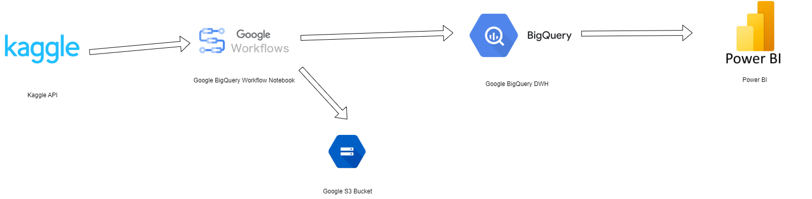

# Data-Engineering Einzelhandel Project

[English version](#Overview)

# Überblick

Das Ziel dieses Projektes ist es, ein vollständiges Data Engineering Projekt
anhand eines fiktiven Elektronik-Einzelhandel Unternehmens darzustellen. Es wird
er komplette Prozess, vom Laden der Daten, transformieren, speichern und
darstellen abgebildet.

## Vorüberlegungen

Das Hauptziel des Projektes ist es, die vorhandenen Unternehmensdaten zu
zentralisieren und dann für datengetriebene Analysen zu nutzen.

Hierbei soll der Prozess des manuellen Übertragens von Daten (was oft sehr
fehleranfällig ist) gelöst werden und somit neueste Daten und Analysen auf
Tagesbasis bereit stehen, ohne zusätzlichen Aufwand zu verursachen.

Daten entstehen hier beim Kauf eines Produktes von Kunden, bei
Rückfragen/Reklamationen auf Kundenseite und bei Marketing Maßnahmen.

Die hier benutzten Daten kommen von:

### Sales Daten:

-   https://www.kaggle.com/datasets/yaminh/product-sales-and-returns-dataset?resource=download

Dieses Dataset wurde dann wie folgt transformiert um besser für dieses Projekt
zu passen:

-   Item Name und Category wurden durch passendere Produkte für ein Elektronik
    Geschäft ersetzt. Neue Produkte:

1. Smartphone
2. Laptop
3. Tablet
4. Smartwatch
5. Bluetooth-Kopfhörer
6. Gaming-Konsole
7. Externe Festplatte
8. USB-Stick
9. Smart-TV
10. Soundbar
11. Digitalkamera
12. E-Book-Reader
13. Gaming-Maus
14. Gaming-Tastatur
15. Monitor
16. Drucker
17. Scanner
18. Heim-Router
19. Smart Home Hub
20. Action-Kamera
21. Drohne
22. Lautsprecher (tragbar)
23. VR-Headset
24. Mikrofon
25. Webcam
26. Powerbank
27. Ladestation
28. Smarte Glühbirnen
29. Elektrischer Fotorahmen
30. NAS-System
31. Netzteil
32. Verlängerungskabel
33. Beamer
34. Projektor-Leinwand
35. Elektronische Waage
36. Digitale Wetterstation
37. Kabelmanagement-Lösung
38. Saugroboter
39. Smarte Steckdose
40. 3D-Drucker
41. RFID-Blocker
42. Video-Türsprechanlage
43. Smartes Thermostat
44. Luftreiniger
45. Smartes Türschloss
46. Gaming-Stuhl
47. Festnetztelefon
48. Bluetooth-Tracker (z.B. für Schlüssel)

-   Pro Zeile wurde ein fiktiver Reklamationsgrund per Zufall hinzugefügt, falls
    es zur Reklamation kam. - Diese (ausgedachten) Gründe sind:
    -   Defekt bei der Lieferung
    -   Nicht funktionstüchtig
    -   Falsches Produkt geliefert
    -   Produkt entspricht nicht der Beschreibung
    -   Fehlende Teile
    -   Beschädigung nach kurzer Nutzung
    -   Inkompatibilität
    -   Schlechter Zustand der Verpackung
    -   Batterieprobleme
    -   Softwarefehler
    -   Verarbeitungsqualität
    -   Überhitzung
    -   Fehlende Dokumentation
    -   Gerät ist schwer zu bedienen
    -   Besseres Produkt gefunden
    -   Ästhetische Mängel
    -   Unzufriedenheit mit der Leistung
    -   Geräuschentwicklung
    -   Falsche Farbe oder Modell
    -   Probleme mit dem Zubehör

### Marketing Daten

-   https://www.kaggle.com/datasets/jsonk11/social-media-advertising-dataset

Diese Daten wurden dann wie folgt transformiert:

-   In der Spalte "Company" wurden die jeweiligen Unternehmen durch die Produkte
    von oben ersetzt und die Spalte umbenannt.
-   So hat man eine fiktive Zuordnung von Kampagenen zu Produkten und kann
    anhand dieser bsp. die Conversion Rate benutzen. Die Verkaufszahlen wurden
    aber vom obigen Dataset genommen.

Die hierfür benutzten Skripte sind im Ordner "data".

Später interessante Analysen für den Kunden sind:

-   Finanzkennzahlen
    -   Gesamter Umsatz nach Monaten aufgeschlüsselt
    -   Gewinn nach Monaten
-   Verkäufe
    -   Daten zu einzelnen Produkten: Umsatz, Kundenstandort, Anzahl verkauft,
        Gewinn
-   Reklamationen
    -   Anzahl Reklamationen pro Produkt
    -   Hauptgründe für die Reklamation
    -   Prozentzahl Reklamationen gesamt
-   Marketing
    -   Kunden nach Marketing Channel
    -   Conversion Rate, Umsatz pro Channel

Diese Daten werden also extrahiert und später übersichtlich im Dashboard
angezeigt.

# Benutzte Technologien

Mage wird benutzt um die Daten aus einer Postgres Datenbank zu laden und
zunächst in einem DataLake (Google S3 Bucket) zu speichern. Dann werden diese
Daten transformiert und anschließend in einem DataWarehouse gespeichert (Google
BigQuery). Anschließend werden die Daten übersichtlich in Google Looker
dargestellt.

Es sind Skripte dabei, um Postgres und Mage lokal in einem Docker Container
laufen zu lassen und später um die komplette Infrastruktur mit Terraform in die
Cloud zu bringen.

# Batch Data Ingestion

Die Daten werden per Mage aus der Postgres Datenbank geladen, dann partioniert
und im .parquet Format abgespeichert. Dies geschieht als DataLake in einem
Google S3 Bucket.

# Data Warehouse

Weiter per Mage werden diese Daten dann transformiert und in das gewünschte
Format gebracht. Sobald dies geschehen ist, werden sie über eine Pipeline in
Google Bigquery gespeichert als Grundlage für die spätere Analyse.

# Dashboard

Das Dashboard ist mit Google Looker erstellt und visualisert die oben genannten
Probleme in verschiedenen Ansichten.

https://lookerstudio.google.com/reporting/3ca912ff-cfa0-426e-927d-2b2305a7161f

# Installation

Um dieses Projekt lokal nachzubilden, sind in dem Ordern "install" die
benötigten Dockerfiles hinterlegt sowie das Layout für das Dashboard. Um das
Projekt in der Cloud darzustellen ist das benötigte Terraform Script ebenfalls
in diesem Ordner. Im Readme ist erklärt, welche Variablen man ändern muss, um es
mit seinem Google Account nutzen zu können.

# Kosten

Nach einer aktuellen Analyse würde dieses Projekt monatlich ca. 80€ Kosten. Die
Kosten bestehen aus:

-   Hosting von Mage auf Google Compute (80€)
-   Daten speichern (Free tier)
-   Daten abfragen (Free tier)
-   Daten visualisieren (Free tier)

Die Entwicklungszeit betrug: 15h

# Overview

The goal of this project is to illustrate a complete data engineering project
using a fictional electronics retail company. The entire process, from loading
data, transforming, storing, and displaying it, is represented.

## Preliminary Considerations

The main goal of the project is to centralize existing company data and use it
for data-driven analyses.

This project aims to solve the process of manually transferring data (which is
often very error-prone), ensuring that the latest data and analyses are
available on a daily basis without additional effort.

Data is generated when a product is purchased by customers, during
inquiries/complaints from the customer side, and through marketing activities.

The data used comes from:

### Sales Data:

-   https://www.kaggle.com/datasets/yaminh/product-sales-and-returns-dataset?resource=download

This dataset was transformed as follows to better suit this project:

-   Item names and categories were replaced with products more fitting for an
    electronics store. New products include:

1. Smartphone
2. Laptop
3. Tablet
4. Smartwatch
5. Bluetooth headphones
6. Gaming console
7. External hard drive
8. USB stick
9. Smart TV
10. Soundbar
11. Digital camera
12. E-book reader
13. Gaming mouse
14. Gaming keyboard
15. Monitor
16. Printer
17. Scanner
18. Home router
19. Smart home hub
20. Action camera
21. Drone
22. Portable speaker
23. VR headset
24. Microphone
25. Webcam
26. Power bank
27. Charging station
28. Smart light bulbs
29. Digital photo frame
30. NAS system
31. Power supply
32. Extension cable
33. Projector
34. Projector screen
35. Electronic scale
36. Digital weather station
37. Cable management solution
38. Robotic vacuum cleaner
39. Smart plug
40. 3D printer
41. RFID blocker
42. Video door intercom system
43. Smart thermostat
44. Air purifier
45. Smart lock
46. Gaming chair
47. Landline phone
48. Bluetooth tracker (e.g., for keys)

-   A fictional reason for complaint was randomly added to each row, if a
    complaint occurred. These (invented) reasons include:
    -   Defective on delivery
    -   Non-functional
    -   Wrong product delivered
    -   Product does not match the description
    -   Missing parts
    -   Damage after short use
    -   Incompatibility
    -   Poor packaging condition
    -   Battery issues
    -   Software errors
    -   Manufacturing quality
    -   Overheating
    -   Missing documentation
    -   Device is hard to use
    -   Found a better product
    -   Aesthetic flaws
    -   Dissatisfaction with performance
    -   Noise issues
    -   Wrong color or model
    -   Issues with accessories

### Marketing Data

-   https://www.kaggle.com/datasets/jsonk11/social-media-advertising-dataset

These data were transformed as follows:

-   In the "Company" column, the respective companies were replaced with the
    products listed above, and the column was renamed.
-   This provides a fictional mapping of campaigns to products, allowing the
    analysis of, for example, conversion rates. The sales figures, however, were
    taken from the dataset above.

The scripts used for this are located in the "data" folder.

Analyses that may be interesting for the customer later include:

-   Financial metrics:
    -   Total revenue broken down by month
    -   Profit by month
-   Sales:
    -   Product-specific data: revenue, customer location, units sold, profit
-   Complaints:
    -   Number of complaints per product
    -   Main reasons for complaints
    -   Percentage of total complaints
-   Marketing:
    -   Customers by marketing channel
    -   Conversion rate, revenue per channel

These data are extracted and later displayed in a dashboard.

# Technologies Used

Mage is used to load data from a Postgres database and initially store it in a
data lake (Google S3 bucket). The data is then transformed and stored in a data
warehouse (Google BigQuery). Finally, the data is presented in Google Looker.

Scripts are provided to run Postgres and Mage locally in a Docker container and
later deploy the entire infrastructure to the cloud using Terraform.

# Batch Data Ingestion

The data is loaded from the Postgres database by Mage, then partitioned and
stored in .parquet format. This is done as a data lake in a Google S3 bucket.

# Data Warehouse

The data is then transformed using Mage and formatted as needed. Once this is
done, it is stored in Google BigQuery via a pipeline as a basis for later
analysis.

# Dashboard

The dashboard is created with Google Looker and visualizes the aforementioned
data in various views.

https://lookerstudio.google.com/reporting/3ca912ff-cfa0-426e-927d-2b2305a7161f

# Installation

To replicate this project locally, the necessary Docker files are located in the
"install" folder, as well as the layout for the dashboard. The Terraform script
for cloud deployment is also included in this folder. The Readme explains which
variables need to be modified to use it with a Google account.

# Costs

According to a current analysis, this project would cost approximately €80 per
month. The costs consist of:

-   Hosting Mage on Google Compute (€80)
-   Data storage (free tier)
-   Data querying (free tier)
-   Data visualization (free tier)

Development time was: 15 hours.
